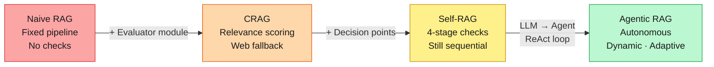
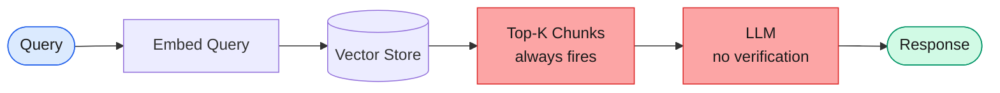
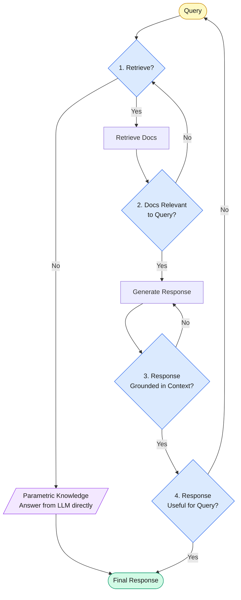
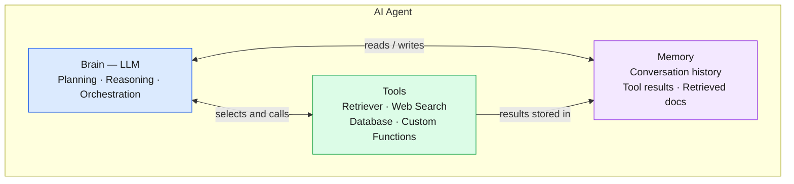
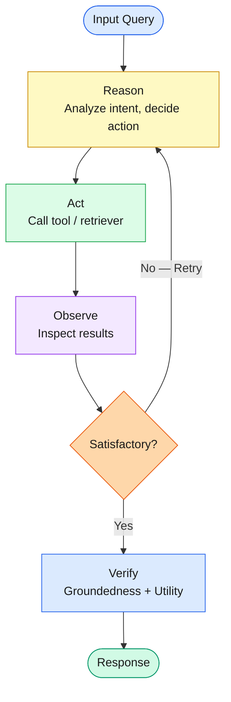
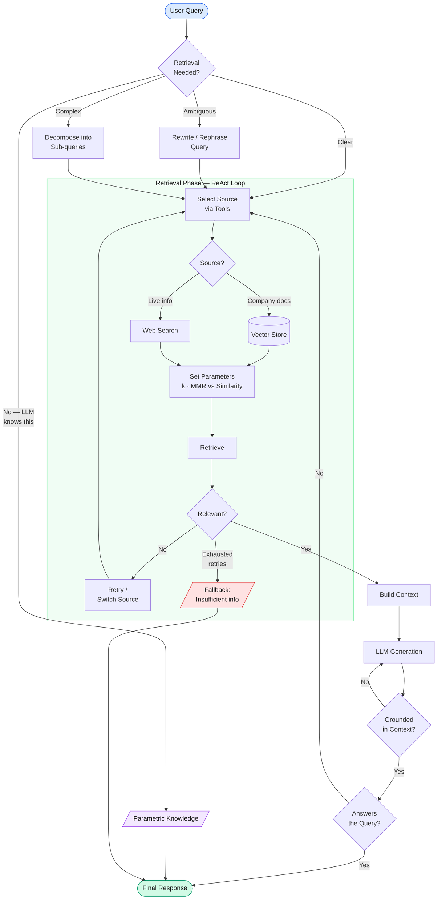

# Module 8 — Agentic RAG with LangGraph

> **What:** Building RAG systems where AI agents autonomously decide whether to retrieve, where to retrieve from, how to retrieve, and whether the result is good enough — all at runtime.
> **Why:** Traditional RAG is a dumb pipeline — fixed sequence, no verification, no adaptation. Agentic RAG replaces that rigidity with an autonomous loop: plan, retrieve, observe, verify, retry or answer.

---

## The RAG Evolution at a Glance

---

## Why Traditional RAG Falls Short

The classic naive RAG flow is: **Query → Embed → Similarity Search → Top-K Retrieval → LLM → Response**

**Advantages of traditional RAG:**
- Simple to implement
- Low latency compared to CRAG / Self-RAG
- Lower cost

**Disadvantages:**
- **No retrieval gate** — retrieval always happens even when the LLM already knows the answer from parametric knowledge. Example: *"What is the capital of India?"* — no external context needed, yet top-K chunks get fetched and passed in anyway.
- **Dumb pipeline** — the sequence is always identical. No query rewriting, no reformulation at runtime.
- **No output verification** — retrieved chunks go directly to the LLM. There is no check on whether retrieved content is relevant or whether the generated response is grounded.

---

## Evolution Toward Agentic RAG

### CRAG (Corrective RAG)

CRAG introduced a quality gate over retrieved chunks — the first acknowledgment that "top-K" is not always "relevant-K."

- An **evaluator module** scores each retrieved document against the input query for relevance.
- Only documents above a relevance threshold contribute to the final context.
- Optionally, a **web search tool** can be invoked when neither the LLM's parametric knowledge nor the vector store contains a satisfactory answer.

**Core idea:** retrieval happens, but a judge decides whether what was retrieved is worth using.

---

### Self-RAG (Self-Reflective RAG)

Self-RAG went further by adding decision points at every stage of the pipeline. The questions are asked in a fixed order:

**Problem Self-RAG still has:** the decision maker at every step is still a plain LLM. The pipeline sequence itself remains hardcoded — it is just smarter at each junction, not truly dynamic.

---

## What is Agentic RAG?

Agentic RAG replaces the plain LLM evaluators in CRAG and Self-RAG with **AI agents** — and that changes everything.

### LLM vs. AI Agent

| | LLM | AI Agent |
|---|---|---|
| Core | Language model only | Brain (LLM) + Memory + Tools |
| Decision-making | Single forward pass | Iterative reasoning loop |
| Actions | Text generation | Tool invocation, retrieval, search, computation |
| Memory | None (stateless) | Conversational history, tool call results, retrieved docs |

### AI Agent Anatomy

### Cognitive capabilities of an AI agent (provided by the Brain component)

- **Planning** — given a query, the agent plans a series of retrieval and reasoning steps
- **Reasoning** — thinks through each planned step before acting
- **Orchestration** — manages the sequence and dependencies between planned tasks

---

## The ReAct Loop — How Agents Stay in Control

Traditional RAG runs a fixed sequence once. Agentic RAG runs a **ReAct loop** (Reasoning + Action) that monitors every step:

**Example — Retrieval stage under ReAct:**
- **Reasoning:** agent inspects the query intent and decides which retriever to use, whether to rewrite the query, what `k` to use
- **Action:** calls the retriever tool
- **Observation:** inspects retrieved documents
- **Exit or Retry:** if results are satisfactory, proceeds; if not, retries with different parameters or a different source

This loop is what makes the pipeline no longer dumb — the agent can change course mid-execution.

---

## Full Agentic RAG Pipeline

---

## Properties of an Agentic RAG System

### 1. Autonomous
- All decision-making inside the RAG pipeline is done by the AI agent
- Minimal or no human intervention during execution

### 2. Adaptive
- Retry logic when retrieval fails or returns poor results
- Can pull from multiple sources in sequence until context is satisfactory
- Makes the pipeline robust and error-tolerant

### 3. Dynamic (Query Phase)

The agent handles the input query intelligently before any retrieval happens:

| Scenario | Agent Action |
|---|---|
| Query answerable from parametric knowledge | Skip retrieval entirely |
| Query is ambiguous or vague | Rewrite query for better retrieval coverage |
| Query has multiple sub-questions | Decompose into sub-queries; retrieve per sub-query |
| Query has metadata filters | Extract metadata and apply filters on retrieval |

### 4. Planning
- Agent plans a series of retrieval and reasoning steps based on query intent
- Order and steps are not hardcoded — they emerge from the query at runtime

### 5. Reasoning
- Agent thinks through each planned step
- Decides what action to take, not just whether to proceed

### 6. Orchestration
- Agent manages execution order and dependencies
- Handles conditional flows (e.g., only book AC train *if* temperature is above threshold — check temperature first)

---

## The Four Questions Agentic RAG Answers at Runtime

| Question | Phase |
|---|---|
| **Whether** to retrieve at all | Query phase — retrieval gate |
| **Where** to retrieve from (vector store, web, database) | Retrieval phase — source selection via tools |
| **How** to retrieve (k value, search mechanism, metadata filters) | Retrieval phase — parameter selection via tools |
| **When** — order of retrieval in multi-step queries | Orchestration — conditional workflow |

---

## Deep Dive: The Retrieval Phase (~80% of the pipeline)

### Where to retrieve from
- The agent uses its **Tool component** to select among multiple retrievers
- Retriever objects (vector store, web search, SQL, etc.) are registered as agent tools
- If one source returns poor results, the agent can retry from a different source

### How to retrieve
- **Similarity search** parameters: `k`, metadata filters
- **MMR (Maximal Marginal Relevance)** parameters: `k`, `fetch_k`, `lambda_multiplier`
- The agent decides both **which mechanism** to use and **what parameter values** to set at runtime
- Example: if the query asks for *diverse* results, the agent chooses MMR over similarity search
- This is driven by the **tool schema** — the agent reads tool descriptions and parameters, then decides values based on query intent

### Relevancy check on retrieved documents
- After retrieval, the agent checks relevance between the query and retrieved docs
- If relevance is insufficient, **retry logic** triggers — fetching from a different source or with different parameters
- A **fallback mechanism** bounds the retry loop to prevent infinite cycles

---

## Generated Response Verification (Self-RAG concepts applied)

Before returning the response, the agent applies two checks carried over from Self-RAG:

1. **Groundedness** — is the response derived from the provided context, or is the model hallucinating?
2. **Utility** — does the response actually answer the user's query?

---

## Good-to-Have Components

### Memory
- **Short-term / conversational memory** — if the same query is asked again in a session, the agent responds from conversation history rather than re-retrieving
- Helps manage context window size by avoiding redundant retrieval

### Dynamic Augmentation (Prompt Engineering at Runtime)
- Rather than a static system prompt, the agent constructs the generation prompt **at runtime**
- Example: if the context came from a company policy vector store, the prompt weights that source more heavily than a web search result
- This makes augmentation source-aware and tunable per query

### Graceful Fallback Mechanism
- Prevents the model from generating hallucinated responses when retrieval fails
- After exhausting the retry budget, the agent responds: *"I don't have sufficient information to answer this."*
- Handles production-level errors gracefully without crashing the pipeline

---

## Traditional RAG vs. Agentic RAG — Summary

| Dimension | Traditional RAG | Agentic RAG |
|---|---|---|
| Retrieval gate | Always retrieves | Agent decides whether to retrieve |
| Pipeline order | Fixed, sequential | Dynamic, planned at runtime via ReAct loop |
| Output verification | None | Groundedness + utility checks |
| Query handling | Raw query passed as-is | Rewrite, rephrase, or decompose at runtime |
| Source selection | Single vector store | Multiple sources via tool registry |
| Retrieval parameters | Hardcoded | Set by agent per query |
| Error recovery | None | Retry logic + graceful fallback |
| Memory | None | Conversational history, tool results |
| Prompt | Static | Dynamic, source-aware at runtime |

---

## Notebooks

| # | Notebook | Description |
|---|----------|-------------|
| 1 | `01_introduction_to_agentic_rag.ipynb` | Naive RAG limitations → CRAG → Self-RAG → Agentic RAG evolution |
| 2 | `02_rag_as_a_tool.ipynb` | Wrapping retrievers as LLM-callable tools with tool schemas |
| 3 | `03_langgraph_fundamentals.ipynb` | State, nodes, edges, conditional routing, and checkpointing in LangGraph |
| 4 | `04_agentic_rag_patterns.ipynb` | ReAct loop, query decomposition, relevance checks, retry logic, and fallback in LangGraph |

---

## Key Takeaways

- Traditional RAG is a dumb pipeline — Agentic RAG is an autonomous reasoning system
- The shift from LLM-as-evaluator (CRAG/Self-RAG) to Agent-as-evaluator is what makes the system truly adaptive
- The ReAct loop (Reason → Act → Observe → Retry/Exit) is the core execution primitive
- AI agents bring three cognitive capabilities: **Planning**, **Reasoning**, and **Orchestration**
- The Tool component is what gives agents multi-source retrieval and runtime parameter control
- Memory, dynamic prompting, and graceful fallback are the production-readiness layer on top of the core pipeline
